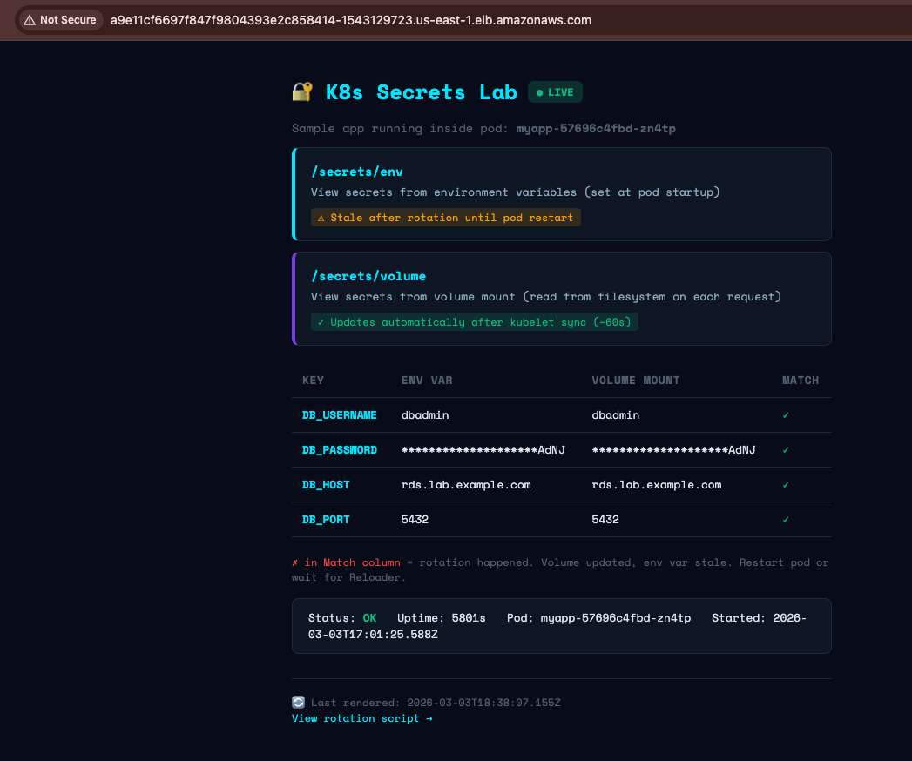
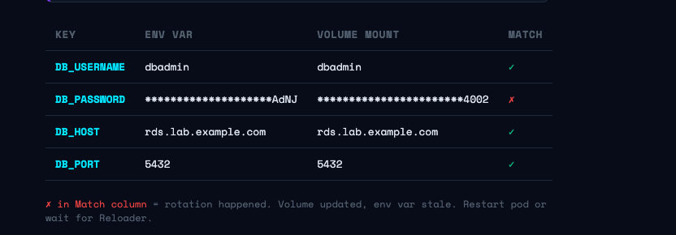

# K8s Secrets Lab

[](https://github.com/Osomudeya/k8s-secret-lab/actions) [](https://opensource.org/licenses/MIT) [](docs/DEPLOY-EKS.md)

Learn how real production systems securely deliver secrets to Kubernetes pods with Terraform, AWS Secrets Manager, External Secrets Operator (ESO), secret rotation (zero-downtime), and CI/CD.

**Quick answers:**  
- **What problem?** Hardcoded secrets and plain K8s Secrets in etcd; you need a secure path from cloud vault → cluster → pod.  
- **What will I learn?** ESO, IRSA, secret rotation (env vs volume), ESO vs CSI, Terraform, and CI/CD with OIDC.  
- **How long?** First working outcome: **5–10 min** (Quick Start). Full local lab **~15 min**; EKS path **~25 min**.  

---

## By the end of this lab you will

- Provision AWS infrastructure with Terraform (Secrets Manager, IAM, optional EKS).
- Sync secrets from AWS Secrets Manager into Kubernetes via ESO.
- Deploy an application that consumes those secrets (env + volume).
- Observe secret rotation and why volume updates while env stays stale until restart.
- Understand the difference between ESO and the Secrets Store CSI driver.

---

## Learning path (START HERE)

1. **Understand the architecture** → [How secrets flow](docs/HOW-IT-WORKS.md) (includes diagram below).
2. **Run the local lab** → Quick Start above or [Local setup](docs/DEPLOY-LOCAL.md).
3. **Observe secret rotation** → [Rotation](docs/ROTATION.md) and `bash rotation/test-rotation.sh`.
4. **Compare ESO vs CSI** → [ESO vs CSI](docs/ESO-VS-CSI.md) and optional [CSI driver on AWS](docs/CSI-DRIVER-AWS.md).
5. **Deploy to EKS** → [EKS setup](docs/DEPLOY-EKS.md) for production-like CI/CD and ALB.

---

## Staged learning (phases) — one concept at a time

The lab touches Terraform, IRSA, ESO, CSI, OIDC, and rotation. To avoid feeling like six lessons at once, treat it in phases. Focus on one phase before moving on.

| Phase | Focus | What you do | Done when… |
|-------|--------|-------------|------------|
| **1. Basic secret sync** | AWS → Kubernetes | Run Quick Start (or [Local setup](docs/DEPLOY-LOCAL.md)). See the app with secrets. | App shows DB_* and **Match ✓**; you’ve seen cloud → cluster → pod. |
| **2. External Secrets Operator** | How ESO fits in | Read [How secrets flow](docs/HOW-IT-WORKS.md). Inspect `ExternalSecret`, `ClusterSecretStore`, and the K8s Secret ESO creates. | You can explain: ESO polls AWS and creates/updates the K8s Secret. |
| **3. Secret rotation** | Env vs volume, zero-downtime | Run `bash rotation/test-rotation.sh` and read [Rotation](docs/ROTATION.md). Watch volume update while env stays stale; then Reloader/rollout. | You can explain why volume updates in place and env needs a restart. |
| **4. CSI driver comparison** | ESO vs CSI | Read [ESO vs CSI](docs/ESO-VS-CSI.md). Optionally try the [CSI path](docs/CSI-DRIVER-AWS.md) (MicroK8s or EKS). | You know when to use ESO vs CSI in production. |
| **5. CI/CD integration** | GitHub Actions, OIDC, EKS | Follow [EKS setup](docs/DEPLOY-EKS.md). Run Terraform in CI, deploy via Actions, run the rotation workflow. | You’ve seen OIDC, EKS access, and CI/CD with no stored credentials. |

You can do phases 1–4 locally (MicroK8s); phase 5 uses EKS and GitHub.

---

## Architecture (high level)

```
GitHub Actions (OIDC) → Terraform → AWS Secrets Manager
                                        ↓
                        External Secrets Operator (ESO)
                                        ↓
                        Kubernetes Secret (myapp-database-creds)
                                        ↓
                        Application Pod (env + volume mount)
```

**Secret flow (data path):**

```
AWS Secrets Manager (prod/myapp/database)
        │
        ▼
ESO polls / force-sync (IRSA or static creds)
        │
        ▼
Kubernetes Secret (myapp-database-creds)
        │
        ├──► env vars (set at pod start; refresh = restart)
        └──► volume mount (/etc/secrets; kubelet updates ~60s)
```

**ESO vs CSI at a glance:**

| | ESO | CSI Driver |
|---|-----|------------|
| **Output** | K8s Secret (env + volume) | Volume mount (optional K8s Secret sync) |
| **Best for** | Most teams, full chain | No-secrets-in-etcd policy, file-only |
| **This lab** | Main path | Optional path → [CSI on AWS](docs/CSI-DRIVER-AWS.md) |

---

## Quick Start (5–10 min) — first working outcome

**Goal:** Run the lab with minimal reading. You’ll see the app serving secrets from AWS → ESO → Kubernetes.

**Prereqs:** [AWS CLI](https://docs.aws.amazon.com/cli/latest/userguide/install-cliv2.html) configured (`aws configure`) and [MicroK8s](https://microk8s.io/docs/getting-started) (or see [Local setup](docs/DEPLOY-LOCAL.md) for full list).

**Three commands:**

```bash
git clone https://github.com/Osomudeya/k8s-secret-lab && cd k8s-secret-lab
bash spinup.sh
# When prompted, choose 2 (MicroK8s). Wait for spinup to finish.
kubectl port-forward svc/myapp 3000:80 -n default
```

Open **http://localhost:3000**. You’re done when you see the app with the secrets table and **Match ✓** for all keys (env and volume both show the same values from AWS Secrets Manager).



*This is the expected result — ESO has synced the secret from AWS into the cluster and the pod is using it.*

Need the full step-by-step or hit an error? → [Local setup](docs/DEPLOY-LOCAL.md) · [Troubleshooting](docs/TROUBLESHOOTING.md).

### Lab checkpoints

| Checkpoint | You’re here when… |
|------------|--------------------|
| **1. Terraform infra** | Spinup finished; AWS secret exists; ESO (and optionally EKS) deployed. |
| **2. Secret in AWS** | `prod/myapp/database` is in Secrets Manager (Terraform or spinup created it). |
| **3. ESO sync** | `kubectl get externalsecret` shows synced; `kubectl get secret myapp-database-creds` exists. |
| **4. Pod reading secret** | App at http://localhost:3000 (or ALB) shows DB_* and **Match ✓**. |
| **5. Rotation test** | After rotating in AWS and syncing, `/secrets/compare` shows `rotation_detected: true`; after rollout, `all_match: true`. |

### Learning validation — prove you understood

Do these checkpoints to confirm you’ve grasped the concepts (not just followed steps).

| # | Task | How to validate |
|---|------|------------------|
| **1** | **Confirm the secret exists in the cluster.** | Run `kubectl get secret myapp-database-creds -n default`. You should see the secret; `kubectl get externalsecret` shows it is synced from ESO. |
| **2** | **Rotate the secret and confirm the pod sees the change.** | Run `bash rotation/test-rotation.sh`. Call the app’s `/secrets/compare` (or watch the in-pod table): you should see `rotation_detected: true` (volume updated, env still old). After a rollout/restart, env and volume match again. |
| **3** | **Explain why env vars do not refresh automatically.** | Answer in your own words: env is set once at container start; the process environment is not updated when the K8s Secret changes. The volume is updated by the kubelet, so the app sees new values on the next read. (See [Rotation](docs/ROTATION.md).) |
| **4** | **Explain what ESO does in one sentence.** | ESO reads from AWS Secrets Manager (or other backends), creates or updates a Kubernetes Secret, and keeps it in sync on a refresh interval. |
| **5** | **When would you choose the CSI driver over ESO?** | When you must avoid storing secrets in etcd, only need file-based access, or want rotation without triggering pod restarts. (See [ESO vs CSI](docs/ESO-VS-CSI.md).) |

These turn the lab into an interactive learning exercise: do the task, then check your answer or result.

---


## What you'll learn

| Concept | What you see in this lab |
|---------|---------------------------|
| External Secrets Operator | Install ESO, create ExternalSecret, watch K8s Secret appear |
| AWS Secrets Manager | Store secrets centrally, control access via IAM |
| IRSA | Pods authenticate to AWS without any access keys |
| Secret rotation | Rotate in AWS SM, watch ESO sync, see env/volume diverge live; **zero-downtime** via Reloader + rolling restart |
| Env vs Volume mounts | Side-by-side live comparison — why they behave differently |
| CI/CD with OIDC | GitHub Actions assumes AWS role — no credentials stored |
| ESO vs CSI Driver | Two patterns explained — why this lab uses ESO |

## Two ways to run this lab

| | Local (MicroK8s) | Production-like (EKS) |
|---|---|---|
| Cost | Free (+ tiny AWS SM cost) | ~$0.16/hr |
| Setup time | ~15 min | ~25 min |
| CI/CD | ✗ | ✓ |
| ALB | ✗ use port-forward | ✓ |
| Best for | Learning the concepts | Full production pattern |

**Local:** `git clone https://github.com/Osomudeya/k8s-secret-lab && cd k8s-secret-lab && bash spinup.sh` (choose 2 — MicroK8s) → [Local setup](docs/DEPLOY-LOCAL.md)

**EKS:** Same clone; `bash spinup.sh` (choose 1 — EKS) → [EKS setup](docs/DEPLOY-EKS.md)

### Quick steps (summary)

**Local (MicroK8s)**  
- Configure AWS (`aws configure`), then clone repo and run `bash spinup.sh`; choose **2 (MicroK8s)**.  
- Spinup provisions Terraform state, AWS Secrets Manager secret, IAM, ESO, SecretStore + ExternalSecret + Deployment.  
- Run `kubectl port-forward svc/myapp 3000:80` and open http://localhost:3000; optionally start the lab UI (`cd lab-ui && npm run dev`).  
- Run `bash rotation/test-rotation.sh` to see rotation; install Reloader for zero-downtime env refresh.  
→ Full steps and prerequisites: [Local setup](docs/DEPLOY-LOCAL.md).

**EKS (production-like)**  
- One-time: set up GitHub OIDC + IAM role (see [terraform/github-oidc](terraform/github-oidc)); set `GITHUB_ACTIONS_ROLE_ARN` before spinup so CI/Teardown can reach the cluster.  
- Clone repo, run `bash spinup.sh --cluster eks` (or choose 1 — EKS). Spinup creates/uses EKS, Terraform state, ESO, ClusterSecretStore (IRSA), AWS secret, and applies K8s manifests.  
- Use the printed ALB URL to open the app; push to `main` to run CI/CD (plan, apply, deploy).  
- Run the **Rotation test** workflow in Actions (or `bash rotation/test-rotation.sh` with kubectl on the cluster).  
→ Full steps and one-time EKS access fix: [EKS setup](docs/DEPLOY-EKS.md).

## See it working



*During rotation: volume updates immediately, env var goes stale. Reloader triggers a rolling restart so new pods get the new secret with no downtime — see [Rotation](docs/ROTATION.md).*

## Repo structure

```
.  README.md  DEPLOY.md  spinup.sh  teardown.sh
docs/  HOW-IT-WORKS.md  DEPLOY-LOCAL.md  DEPLOY-EKS.md  TERRAFORM.md  ROTATION.md  ESO-VS-CSI.md  TROUBLESHOOTING.md  CSI-DRIVER-AWS.md
terraform/aws/  main.tf  eso.tf  iam.tf  secret.tf  eks.tf  variables.tf  outputs.tf
terraform/github-oidc/  OIDC + GitHub Actions IAM role
k8s/aws/  external-secret.yaml  deployment.yaml  secret-store-static.yaml
app/  server.js  Dockerfile   lab-ui/   rotation/test-rotation.sh   .github/workflows/
```

## Common failure scenarios

When something breaks, check [Troubleshooting](docs/TROUBLESHOOTING.md) first. It covers:

| Scenario | Where to look |
|----------|----------------|
| **IRSA / permission errors** | EKS & Terraform apply; ESO; Common AWS |
| **ESO CRD not syncing** | ESO; MicroK8s (SecretStore, credentials) |
| **CSI mount failures** | [CSI driver doc](docs/CSI-DRIVER-AWS.md) (auth, SecretProviderClass) |
| **Terraform state issues** | Terraform (general); CI/CD (backend) |
| **IAM policy mistakes** | Common AWS; ESO (GetSecretValue) |

Learners gain the most when they debug failures; the troubleshooting doc has symptom → cause → fix tables.

---

## What this project demonstrates to employers

This repo shows you can design and document a **production-style secret management path**: cloud vault → sync layer → Kubernetes → application, with rotation and CI/CD.

- **Architecture:** Terraform for infra, ESO (or CSI) for sync, IRSA for auth, no credentials in Git or container images.
- **Design choices:** Why ESO on the main path (K8s Secret, env + volume, one operator multi-cloud) and when to use the CSI driver instead ([ESO vs CSI](docs/ESO-VS-CSI.md)).
- **Operations:** Secret rotation, env vs volume behavior, zero-downtime rollout with Reloader, and CI/CD using OIDC (no long-lived keys).
- **Documentation:** Staged learning, validation checkpoints, troubleshooting, and clear runbooks for local vs EKS.

Use it as a portfolio piece: point to the README, architecture diagrams, and the fact that you can walk through the flow and debug common failures.

---

## Community & contributing

- **Questions or ideas?** Open a [GitHub Discussion](https://github.com/Osomudeya/k8s-secret-lab/discussions) or an [issue](https://github.com/Osomudeya/k8s-secret-lab/issues).
- **Roadmap:** See [Future labs / content expansion](#future-labs--content-expansion) below.

---

## Future labs / content expansion

This lab could extend into:

- **HashiCorp Vault** integration (Vault provider for ESO or CSI).
- **Sealed Secrets** (encrypt secrets in Git, decrypt in-cluster).
- **SOPS** (encrypted files in repo, decrypted in CI or at deploy).
- **Multi-cluster** secret management and replication.
- **GitOps** secret workflows (e.g. ESO + Argo CD/Flux).

---

## Dive deeper

If this lab helped and you want to go further:

- **[DevOps Operating System](https://osomudeya.gumroad.com/l/devops-atlas)** — A Self Paced or 6-week structured path from basics (Linux, Git, Docker, Kubernetes on MicroK8s) to production-style work: real tickets, infra tasks, and a capstone system you build end-to-end. Same stack as this lab; for when you’re ready to move from one project to a hireable skillset.
- **[The Kubernetes Detective](https://osomudeya.gumroad.com/l/jabzk)** — When a pod is crashing and `kubectl logs` isn’t enough, this is the systematic debugging method that turns panic into a process. Fits well after hitting the [Troubleshooting](docs/TROUBLESHOOTING.md) section here.
- **[List of DevOps Projects](https://github.com/Osomudeya/List-Of-DevOps-Projects)** (free) — A curated list of hands-on DevOps projects (home lab, CI/CD, AWS, troubleshooting). Good next step if you want more production-style labs like this one.

---

## ⚠ Cost warning (EKS only)

EKS ~$0.16/hr. Run `bash teardown.sh` when done.

## Navigation

- [How secrets flow →](docs/HOW-IT-WORKS.md) · [Local setup →](docs/DEPLOY-LOCAL.md) · [EKS setup →](docs/DEPLOY-EKS.md) · [Terraform →](docs/TERRAFORM.md) · [Rotation →](docs/ROTATION.md) · [ESO vs CSI →](docs/ESO-VS-CSI.md) · [Troubleshooting →](docs/TROUBLESHOOTING.md)
